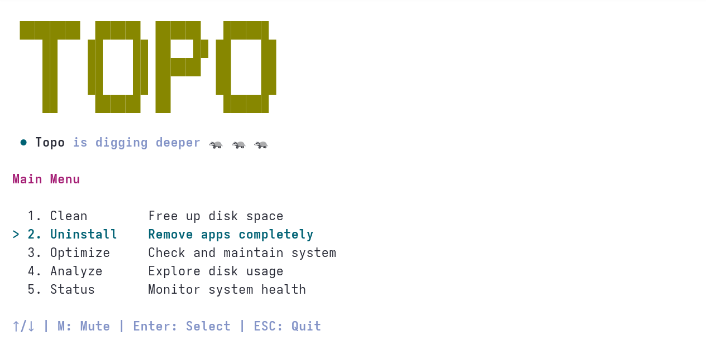

<div align="center">
  <h1>🦡 Topo</h1>
  <p><em>High-performance system optimization and cleanup for Linux.</em></p>
</div>

<p align="center">
  <a href="https://github.com/Jesencloud/Topo/stargazers"></a>
  <a href="https://github.com/Jesencloud/Topo/releases"></a>
  <a href="LICENSE"></a>
  <a href="https://github.com/Jesencloud/Topo/commits"></a>
  <a href="https://github.com/Jesencloud/Topo"></a>
</p>

<p align="center">
  
</p>

> The most elegant way to keep your Linux system lean and mean. Inspired by the minimalist philosophy of [Mole](https://github.com/tw93/mole) on macOS.

## Features

- **All-in-one toolkit**: Combines package managers (DNF/APT/Pacman), App Uninstaller, Disk Analyzer, and Monitor in a **single tool**.
- **Intelligent cleanup**: Features a proactive detection engine that auto-discovers unknown apps, AppImage remnants, and orphaned data.
- **AI Developer ready**: Reclaims gigabytes with age-aware purging for Hugging Face, Ollama, PyTorch, and CUDA caches.
- **Cross-distro support**: Deep cleans Ubuntu Snaps, Multipass, Flatpaks, and Fedora Podman/Docker environments.
- **Disk insights**: Ultra-fast disk explorer powered by a **Rust scanning engine** with parallel I/O.
- **Live monitoring**: Real-time dashboard showing CPU, GPU, memory, and top resource-consuming processes.

## Quick Start

**Automated Installation (Recommended)**

```bash
curl -fsSL https://raw.githubusercontent.com/Jesencloud/Topo/main/install.sh | bash
```

> Note: The script automatically detects your architecture (**x86_64** or **ARM64**) and provisions the optimized engine.

**Run**
<p align="center">
  
</p>

```bash
topo                           # Start interactive TUI (Recommended)
topo clean                     # One-key safe cleanup
topo uninstall                 # Deep application uninstaller
topo optimize                  # Refresh system services & maintenance
topo analyze                   # Ultra-fast disk usage explorer
topo status                    # Live system health dashboard
topo history                   # Show recent cleanup/deletion history
topo history --limit 5         # Show the latest 5 history sessions

topo update                    # Upgrade Topo to the latest version
topo link                      # Re-configure system-wide command
topo remove                    # Safely remove Topo from system
topo --help                    # Show help
```

## Security & Safety Design

Topo is built for performance but governed by safety. It uses **Home Directory Isolation** for manual cleanup and a **Global Whitelist** to ensure critical system paths remain untouched. 

It adopts a **Zero-Interruption** policy: administrative tasks are pre-authorized so your "One-Key Clean" runs unattended from start to finish.

## Features in Detail

### Deep System Cleanup

```bash
$ topo clean
[EXECUTING] Starting system cleanup...

 🔒 Authorizing system-level tasks (Ctrl+C to cancel)...
 ✓ Authorization successful.

➤ System & Package Manager
  ✓ Cleaned DNF cache (1.2 GB)
  ✓ Vacuumed journal logs (218 MB)

➤ Developer Tools & AI Models
  ✓ Cargo cache (44.5 MB) cleaned

============================================================
Cleanup complete

Breakdown:
  • Package Manager Cache        1.2 GB (1 items)
  • Developer Artifacts         44.5 MB (1 items)

Total space freed: 1.25 GB | Items: 2
Free space now: 482.2 GB
============================================================
```

### Smart App Uninstaller

Select apps to remove and Topo will find all associated residues.

```bash
Select Application to Uninstall
--------------------------------------------------------------------------------
  [1] google-chrome-stable                          4.0 GB | 5d ago
  [2] cursor                                        1.0 GB | Yesterday
  [3] net.thunderbird.Thunderbird                 871.2 MB | 4d ago
  [4] wechat                                      750.6 MB | 0y ago
  [✓] brave-browser                               449.1 MB | 5d ago
▶ [✓] org.telegram.desktop                        351.5 MB | 4d ago
  [7] libreoffice-core                            302.3 MB | 2d ago
  [8] ibus                                        221.8 MB | 0y ago
  [9] clash-verge                                 182.0 MB | 0y ago
  [0] gnome-software                              128.0 MB | 0y ago
--------------------------------------------------------------------------------
 Page 1/8 | Space: Select | Enter: Confirm | S/N/T/O: Sort ↓ | ESC: Exit

 ☉ Selected Apps to Remove:
   • brave-browser
   • org.telegram.desktop
```

### Cleanup History

Topo records cleanup and uninstall deletion events so you can review what changed after a run.

```bash
$ topo history --limit 5
Deletion History
------------------------------------------------------------------------
2026-05-31T12:30:00+08:00 -> 2026-05-31T12:30:04+08:00  clean
  removed=4  trashed=0  skipped=1  failed=0  size=512.0 MiB
    deleted              /home/user/.cache/example
```

### Intelligence Analyze

Powered by a dedicated Rust engine, Topo scans hundreds of thousands of files in milliseconds.

```bash
Analyze Disk
Select a category to explore:

▶   1. ▬▬▬▬▬▬▬▬▬▬▬▬▬▬▬▬▬▬▬▬  100.0%  |  📁 Root (/)                                          23.5 GB
    2. ▬▬▬▬▬▬▬▬▬▬▬▬▬▬▬▬▬▬▬▬   35.7%  |  📁 System                                             8.4 GB
    3. ▬▬▬▬▬▬▬▬▬▬▬▬▬▬▬▬▬▬▬▬    7.3%  |  📁 Home                                               1.7 GB
    4. ▬▬▬▬▬▬▬▬▬▬▬▬▬▬▬▬▬▬▬▬    0.8%  |  👀 System Logs                                      189.8 MB
    5. ▬▬▬▬▬▬▬▬▬▬▬▬▬▬▬▬▬▬▬▬    0.1%  |  👀 Cargo Cache                                       30.8 MB
    6. ▬▬▬▬▬▬▬▬▬▬▬▬▬▬▬▬▬▬▬▬    0.0%  |  📁 Applications                                       1.3 MB

------------------------------------------------------------------------------------------------------------
 ↑↓←→ | Num Select | Space Select | A All | ← Back | Enter Open | F Folder | L Largest | Del Delete | R Refresh | S Sort ↓ | ESC Exit
```

## Technical Advantages

- **Multi-Arch Native**: Optimized binaries for both **x86_64** and **ARM64** (Apple Silicon, Raspberry Pi).
- **Self-Learning Registry**: Automatically learns your installed apps to provide process-safe, high-precision cleaning without relying solely on hardcoded lists.
- **Terminal History Protection**: Uses the Alternate Screen Buffer to ensure your terminal session history is perfectly preserved upon exit.
- **Intelligent Silence**: "Silent on zero-gain" policy—only shows what actually matters.
- **Zero-Latency UI**: Built-in **ScanCache** for instant directory navigation.
- **Hybrid Power**: High-level flexibility of Python combined with the raw speed of Rust.

## License

MIT License. Developed with ❤️ for the Linux community.
